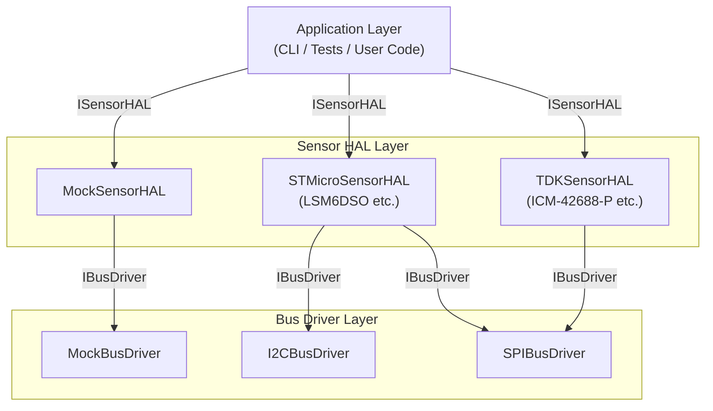
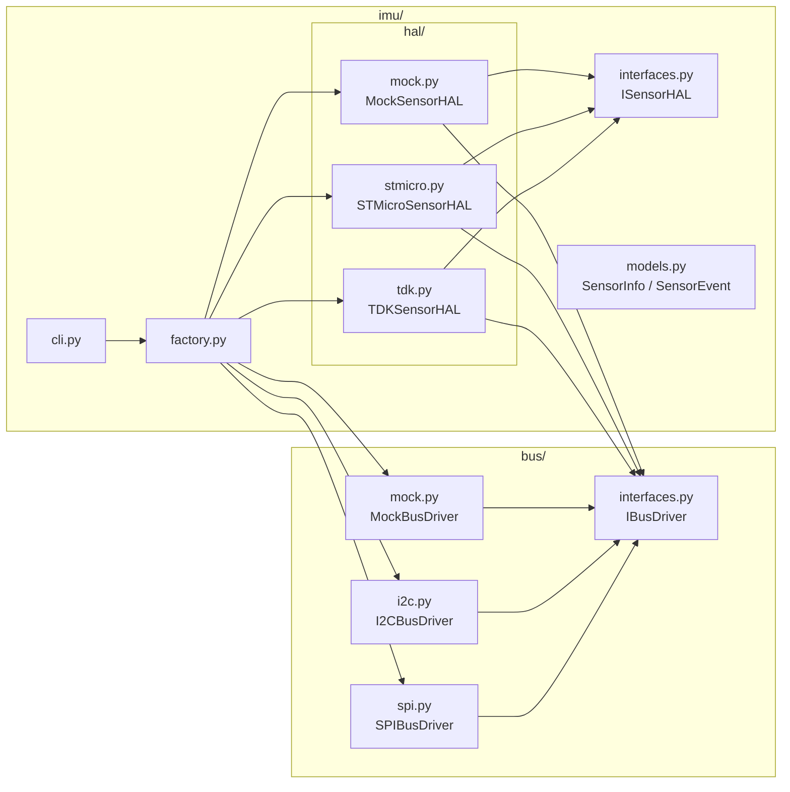

# IMU HAL Developer Documentation

## 1. Architecture Overview

### Layer Structure Diagram



### Module Dependency Diagram



### Design Principles

This IMU HAL is inspired by the [Android Sensors AIDL HAL](https://source.android.com/docs/core/interaction/sensors/sensors-aidl-hal) design and follows these principles:

- **Dependency Inversion Principle (DIP)**: The application layer depends only on the abstract interfaces `ISensorHAL` and `IBusDriver`
- **Dependency Injection (DI)**: Bus drivers are injected into Sensor HALs via `initialize(bus)`
- **Testability**: `MockBusDriver` and `MockSensorHAL` enable testing without hardware

---

## 2. Quick Start

### Prerequisites

```bash
# Install dependencies
uv sync
```

### Verifying with MockSensorHAL + CLI

```bash
# List sensors (mock HAL / mock bus)
uv run python -m ai_driven_development_labs.imu.cli list-sensors --hal mock --bus mock

# Read sensor data (3 times, 1 second interval)
uv run python -m ai_driven_development_labs.imu.cli read --hal mock --bus mock --count 3 --interval 1.0

# Read once in JSON format
uv run python -m ai_driven_development_labs.imu.cli read-once --hal mock --bus mock --format json
```

### Usage from Python Code

```python
from ai_driven_development_labs.bus.mock import MockBusDriver
from ai_driven_development_labs.imu.hal.mock import MockSensorHAL

# Create bus driver and sensor HAL
bus = MockBusDriver()
hal = MockSensorHAL()

# Initialize HAL (inject bus driver via DI)
hal.initialize(bus)

# Get sensor list
sensors = hal.get_sensor_list()
for sensor in sensors:
    print(f"  {sensor.name} (handle={sensor.sensor_handle})")

# Activate sensors and read data
for sensor in sensors:
    hal.activate(sensor.sensor_handle, True)

events = hal.get_events()
for event in events:
    print(f"  {event.sensor_type.name}: {event.values}")

# Release resources
hal.finalize()
```

### Verifying with STMicro HAL + MockBusDriver

```python
from ai_driven_development_labs.bus.mock import MockBusDriver
from ai_driven_development_labs.imu.hal.stmicro import STMicroSensorHAL

# Emulate LSM6DSO register map
register_map = {
    0x0F: 0x6C,  # WHO_AM_I = LSM6DSO
    0x1E: 0x03,  # STATUS_REG: accel + gyro data ready
}
bus = MockBusDriver(register_map=register_map)
hal = STMicroSensorHAL()
hal.initialize(bus)

sensors = hal.get_sensor_list()
hal.finalize()
```

---

## 3. Adding a New Vendor Guide

This section explains how to add a new IMU vendor by implementing `ISensorHAL`.

### Step 1: Create the HAL Class

Create a new file under `ai_driven_development_labs/imu/hal/`. Example: `bosch.py`

```python
"""Bosch IMU HAL (BMI270 etc.) implementation."""

import struct
import time

from ai_driven_development_labs.bus.interfaces import IBusDriver
from ai_driven_development_labs.imu.interfaces import ISensorHAL
from ai_driven_development_labs.imu.models import ReportingMode, SensorEvent, SensorInfo, SensorType

_ACCEL_HANDLE = 1
_GYRO_HANDLE = 2

# Register addresses (BMI270 example)
_REG_CHIP_ID = 0x00   # CHIP_ID
_REG_STATUS = 0x03    # STATUS

# Scale conversion factors (±2g, ±2000 dps example)
_ACCEL_SENSITIVITY_G_PER_LSB = 1.0 / 16384.0
_GYRO_SENSITIVITY_DPS_PER_LSB = 1.0 / 16.4


class BoschSensorHAL(ISensorHAL):
    """HAL for Bosch IMUs (BMI270 etc.)."""

    SUPPORTED_DEVICES: dict[int, str] = {
        0x24: "BMI270",
    }

    def __init__(self) -> None:
        self._bus: IBusDriver | None = None
        self._device_name: str = ""
        self._active: dict[int, bool] = {}

    def initialize(self, bus: IBusDriver) -> None:
        bus.open()
        self._bus = bus

        chip_id = bus.read_register(_REG_CHIP_ID, 1)[0]
        if chip_id not in self.SUPPORTED_DEVICES:
            bus.close()
            self._bus = None
            raise RuntimeError(f"Unsupported device: CHIP_ID=0x{chip_id:02X}")
        self._device_name = self.SUPPORTED_DEVICES[chip_id]
        self._active = {_ACCEL_HANDLE: False, _GYRO_HANDLE: False}

    def get_sensor_list(self) -> list[SensorInfo]:
        return [
            SensorInfo(
                sensor_handle=_ACCEL_HANDLE,
                name=f"{self._device_name} Accelerometer",
                vendor="Bosch",
                sensor_type=SensorType.ACCELEROMETER,
                reporting_mode=ReportingMode.CONTINUOUS,
            ),
            SensorInfo(
                sensor_handle=_GYRO_HANDLE,
                name=f"{self._device_name} Gyroscope",
                vendor="Bosch",
                sensor_type=SensorType.GYROSCOPE,
                reporting_mode=ReportingMode.CONTINUOUS,
            ),
        ]

    def activate(self, sensor_handle: int, enabled: bool) -> None:
        self._active[sensor_handle] = enabled

    def configure(self, sensor_handle: int, sampling_period_us: int, max_report_latency_us: int) -> None:
        pass  # Implement ODR configuration

    def flush(self, sensor_handle: int) -> None:
        pass

    def get_events(self) -> list[SensorEvent]:
        if self._bus is None:
            return []
        # Check STATUS register for data ready and read output registers
        # ... implementation omitted ...
        return []

    def finalize(self) -> None:
        if self._bus is not None:
            self._bus.close()
            self._bus = None
        self._active = {}
```

### Step 2: Register in factory.py

Add the new HAL to `create_sensor_hal()` in `ai_driven_development_labs/imu/factory.py`:

```python
from ai_driven_development_labs.imu.hal.bosch import BoschSensorHAL

def create_sensor_hal(hal_type: str) -> ISensorHAL:
    match hal_type:
        case "mock":
            return MockSensorHAL()
        case "stmicro":
            return STMicroSensorHAL()
        case "tdk":
            return TDKSensorHAL()
        case "bosch":           # Added
            return BoschSensorHAL()
        case _:
            raise ValueError(f"Unknown HAL type: {hal_type}")
```

### Step 3: Add Tests

Add a new test file under `tests/test_imu/test_hal/`:

```python
# tests/test_imu/test_hal/test_bosch.py
from ai_driven_development_labs.bus.mock import MockBusDriver
from ai_driven_development_labs.imu.hal.bosch import BoschSensorHAL
from ai_driven_development_labs.imu.models import SensorType


class TestBoschSensorHAL:
    def test_initialize_with_supported_device(self):
        bus = MockBusDriver(register_map={0x00: 0x24})  # BMI270
        hal = BoschSensorHAL()
        hal.initialize(bus)
        sensors = hal.get_sensor_list()
        assert any(s.sensor_type == SensorType.ACCELEROMETER for s in sensors)
        hal.finalize()
```

---

## 4. Adding a New Bus Driver Guide

This section explains how to add a new peripheral bus by implementing `IBusDriver`.

### Step 1: Create the Bus Driver Class

Create a new file under `ai_driven_development_labs/bus/`. Example: `uart.py`

```python
"""UART bus driver implementation."""

from ai_driven_development_labs.bus.interfaces import IBusDriver


class UARTBusDriver(IBusDriver):
    """Bus driver for communicating with sensors via UART."""

    def __init__(self, port: str = "/dev/ttyUSB0", baudrate: int = 115200):
        self._port = port
        self._baudrate = baudrate
        self._serial = None  # Use pyserial or similar

    def open(self) -> None:
        """Open the UART port."""
        # import serial
        # self._serial = serial.Serial(self._port, self._baudrate)
        ...

    def close(self) -> None:
        """Close the UART port."""
        if self._serial is not None:
            # self._serial.close()
            self._serial = None

    def read_register(self, register: int, length: int) -> bytes:
        """Read the specified number of bytes from a register."""
        # Protocol-specific implementation
        ...
        return bytes(length)

    def write_register(self, register: int, data: bytes) -> None:
        """Write data to a register."""
        ...

    def transfer(self, data: bytes) -> bytes:
        """Perform a full-duplex transfer."""
        ...
        return bytes(len(data))
```

### Step 2: Register in factory.py

Add to `create_bus_driver()` in `ai_driven_development_labs/imu/factory.py`:

```python
from ai_driven_development_labs.bus.uart import UARTBusDriver

def create_bus_driver(bus_type: str, bus_id: int = 0, device: int = 0) -> IBusDriver:
    match bus_type:
        case "mock":
            return MockBusDriver()
        case "i2c":
            return I2CBusDriver(bus_id=bus_id, address=device)
        case "spi":
            return SPIBusDriver(bus=bus_id, device=device)
        case "uart":            # Added
            return UARTBusDriver(port=f"/dev/ttyUSB{bus_id}")
        case _:
            raise ValueError(f"Unknown bus type: {bus_type}")
```

### Step 3: Add Tests

Add tests to verify that each `IBusDriver` method works as expected:

```python
# tests/test_bus/test_uart_bus.py
from ai_driven_development_labs.bus.uart import UARTBusDriver
from ai_driven_development_labs.bus.interfaces import IBusDriver


class TestUARTBusDriver:
    def test_is_instance_of_ibus_driver(self):
        bus = UARTBusDriver()
        assert isinstance(bus, IBusDriver)
```

---

## 5. API Reference

### `IBusDriver` (Abstract Base Class)

**Module**: `ai_driven_development_labs.bus.interfaces`

Abstract interface for communicating with peripheral buses.

| Method | Signature | Description |
|--------|-----------|-------------|
| `open` | `() -> None` | Initialize the bus and start communication. |
| `close` | `() -> None` | Close the bus and release resources. |
| `read_register` | `(register: int, length: int) -> bytes` | Read `length` bytes from the specified register. |
| `write_register` | `(register: int, data: bytes) -> None` | Write data to the specified register. |
| `transfer` | `(data: bytes) -> bytes` | Perform a full-duplex transfer and return received data (for SPI). |

### `ISensorHAL` (Abstract Base Class)

**Module**: `ai_driven_development_labs.imu.interfaces`

Abstract sensor HAL interface conforming to Android `ISensors.aidl`.

| Method | Signature | Description |
|--------|-----------|-------------|
| `initialize` | `(bus: IBusDriver) -> None` | Initialize the HAL. Receives the bus driver via DI. |
| `get_sensor_list` | `() -> list[SensorInfo]` | Return a list of available sensors. |
| `activate` | `(sensor_handle: int, enabled: bool) -> None` | Enable/disable a sensor. |
| `configure` | `(sensor_handle: int, sampling_period_us: int, max_report_latency_us: int) -> None` | Set the sampling period and maximum report latency. |
| `flush` | `(sensor_handle: int) -> None` | Flush the FIFO buffer. |
| `get_events` | `() -> list[SensorEvent]` | Get the latest sensor events. |
| `finalize` | `() -> None` | Finalize the HAL and release resources. |

### `SensorInfo` (Data Class)

**Module**: `ai_driven_development_labs.imu.models`

Sensor information conforming to Android `SensorInfo.aidl`. Immutable data class with `frozen=True`.

| Field | Type | Description |
|-------|------|-------------|
| `sensor_handle` | `int` | Unique handle identifying the sensor. |
| `name` | `str` | Name of the sensor. |
| `vendor` | `str` | Vendor name of the sensor. |
| `sensor_type` | `SensorType` | Type of the sensor. |
| `version` | `int` | HAL version (default: 1). |
| `max_range` | `float` | Maximum measurement range of the sensor. |
| `resolution` | `float` | Resolution of the sensor. |
| `power` | `float` | Current consumption (mA). |
| `min_delay` | `int` | Minimum sampling period (μs). 0 means on-demand. |
| `max_delay` | `int` | Maximum sampling period (μs). |
| `fifo_reserved_event_count` | `int` | Number of events reserved in the FIFO. |
| `fifo_max_event_count` | `int` | Maximum number of events in the FIFO. |
| `reporting_mode` | `ReportingMode` | Reporting mode. |

### `SensorEvent` (Data Class)

**Module**: `ai_driven_development_labs.imu.models`

Sensor event conforming to Android `Event.aidl`.

| Field | Type | Description |
|-------|------|-------------|
| `sensor_handle` | `int` | Handle of the sensor that generated the event. |
| `sensor_type` | `SensorType` | Type of the sensor. |
| `timestamp_ns` | `int` | Event timestamp (nanoseconds). |
| `values` | `list[float]` | List of sensor measurement values (e.g., [x, y, z]). |

### `SensorType` (IntEnum)

**Module**: `ai_driven_development_labs.imu.models`

| Value | Constant | Description |
|-------|----------|-------------|
| 1 | `ACCELEROMETER` | Accelerometer |
| 4 | `GYROSCOPE` | Gyroscope |
| 35 | `ACCELEROMETER_UNCALIBRATED` | Uncalibrated Accelerometer |
| 16 | `GYROSCOPE_UNCALIBRATED` | Uncalibrated Gyroscope |

### `ReportingMode` (IntEnum)

**Module**: `ai_driven_development_labs.imu.models`

| Value | Constant | Description |
|-------|----------|-------------|
| 0 | `CONTINUOUS` | Reports data at a fixed interval. |
| 1 | `ON_CHANGE` | Reports data when the value changes. |
| 2 | `ONE_SHOT` | Reports data only once. |
| 3 | `SPECIAL_TRIGGER` | Reports data under specific trigger conditions. |

### `MockBusDriver`

**Module**: `ai_driven_development_labs.bus.mock`

A mock bus driver that manages virtual register maps in memory. For testing and emulation purposes.

```python
MockBusDriver(register_map: dict[int, int] | None = None)
```

- `register_map`: Dictionary of initial register values `{register_addr: value}`. Unregistered registers return `0x00`.

### `MockSensorHAL`

**Module**: `ai_driven_development_labs.imu.hal.mock`

A mock HAL that operates without hardware. Generates random or fixed-pattern sensor data.

```python
MockSensorHAL(
    accel_range: float = 16.0,
    gyro_range: float = 2000.0,
    noise_stddev: float = 0.01,
)
```

- `accel_range`: Full-scale range of the accelerometer (g).
- `gyro_range`: Full-scale range of the gyroscope (dps).
- `noise_stddev`: Standard deviation of sensor noise.

### `STMicroSensorHAL`

**Module**: `ai_driven_development_labs.imu.hal.stmicro`

HAL for STMicroelectronics IMUs (LSM6DSO / ISM330DHCX etc.). Identifies the device using the WHO_AM_I register (0x0F).

Supported devices:

| WHO_AM_I | Device Name |
|----------|-------------|
| 0x6C | LSM6DSO |
| 0x6B | ISM330DHCX |

### `TDKSensorHAL`

**Module**: `ai_driven_development_labs.imu.hal.tdk`

HAL for TDK InvenSense IMUs (ICM-42688-P etc.). Identifies the device using the WHO_AM_I register (0x75).

---

## References

- [Android Sensors AIDL HAL - Validation](https://source.android.com/docs/core/interaction/sensors/sensors-aidl-hal#validation)
- [Android ISensors.aidl](https://source.android.com/docs/core/interaction/sensors)
