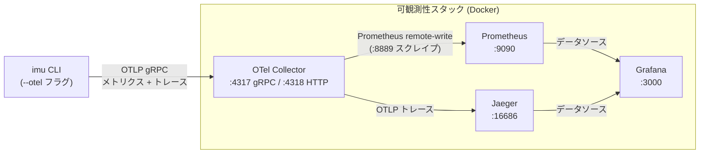

# ローカル可視化基盤 — セットアップ & 運用ドキュメント

このページでは、IMU CLI 向けのローカル可観測性基盤
(OTel Collector → Prometheus / Jaeger → Grafana) のセットアップと運用方法を説明します。

---

## 1. アーキテクチャ概要



### コンポーネント一覧

| コンポーネント | イメージ | 役割 |
|---------------|---------|------|
| OTel Collector | `otel/opentelemetry-collector-contrib` | OTLP テレメトリを受信し、各バックエンドへ転送 |
| Prometheus | `prom/prometheus` | Collector からメトリクスをスクレイプして保存 |
| Jaeger | `jaegertracing/all-in-one` | 分散トレースの保存と可視化 |
| Grafana | `grafana/grafana` | 統合ダッシュボード (Prometheus + Jaeger データソース) |

---

## 2. クイックスタート

### 前提条件

- [Docker](https://docs.docker.com/get-docker/) ≥ 24 (Compose プラグイン込み)
- [uv](https://docs.astral.sh/uv/getting-started/installation/) (Python パッケージマネージャ)
- [GNU Make](https://www.gnu.org/software/make/)

### Step 1 — `.env` の作成

```shell
cp .env.template .env
```

`.env` を編集し、必要に応じてパスワードを変更します（ローカル開発ではデフォルト値のままでも構いません）：

```dotenv
GF_SECURITY_ADMIN_PASSWORD=changeme   # Grafana 管理者パスワード
GF_VIEWER_PASSWORD=viewerpass         # Grafana ビューアーパスワード
```

### Step 2 — スタックの起動

```shell
make obs-up
```

以下のコンテナがバックグラウンドで起動します：

| コンテナ | ポート |
|---------|-------|
| `adl-otel-collector` | 4317 (gRPC), 4318 (HTTP) |
| `adl-prometheus` | 9090 |
| `adl-jaeger` | 16686 |
| `adl-grafana` | 3000 |

すべてのサービスが正常に起動するまで、10 秒程度お待ちください。

### Step 3 — テレメトリの送信

`--otel` フラグを付けて IMU CLI を実行し、メトリクスとトレースをローカルの Collector に送信します：

```shell
uv run python -m ai_driven_development_labs.imu.cli read \
    --hal mock --bus mock --count 10 --interval 1.0 --otel
```

デフォルトでは `http://localhost:4317` に OTLP gRPC で送信します。
変更する場合は `OTEL_EXPORTER_OTLP_ENDPOINT` 環境変数で上書きしてください。

### Step 4 — Grafana へのログイン

ブラウザで <http://localhost:3000> を開き、以下の認証情報でログインします：

| 項目 | 値 |
|------|----|
| ユーザー名 | `admin` |
| パスワード | `.env` の `GF_SECURITY_ADMIN_PASSWORD` (デフォルト: `changeme`) |

初回起動時に **ビューアー** アカウント (`viewer` / `GF_VIEWER_PASSWORD` の値) が自動作成されます。

ログイン後、**IMU Sensor Dashboard** を開くと、加速度計・ジャイロスコープのリアルタイム値、
IMU 読み取りレイテンシのヒートマップ、Jaeger の最新トレース一覧を確認できます。


---

## 3. トラブルシューティング

### ポート衝突 — コンテナが起動しない

ポートがすでに使用中の場合、Docker はバインドに失敗します。

```text
Error response from daemon: Ports are not available: exposing port TCP 0.0.0.0:3000 -> 0.0.0.0:0: ...
```

競合しているプロセスを特定して停止します：

```shell
# macOS / Linux
sudo lsof -i :<PORT>

# プロセスを停止（<PID> を実際の PID に置き換えてください）
kill <PID>
```

または `compose.observability.yml` のホスト側ポートマッピングを変更します：

```yaml
ports:
  - "3001:3000"   # ホスト 3001 → コンテナ 3000 にマッピング
```

### Collector ログの確認

Collector がテレメトリを受信しているか確認するには：

```shell
make obs-logs
```

Collector コンテナのみを確認する場合：

```shell
docker logs adl-otel-collector --follow
```

以下のような行が出力されていれば正常です：

```text
MetricsExporter    {"resource metrics": 1, "metrics": 6, "data points": 6}
TracesExporter     {"resource spans": 1, "spans": 1}
```

### Grafana に「No data」と表示される

1. Collector がデータを受信しているか確認します（上記参照）。
2. <http://localhost:9090/targets> で Prometheus のスクレイプ状況を確認します。
3. Grafana の **Explore** で **Prometheus** データソースを選択し、`imu_accel_x` などの IMU メトリクス名でクエリします。

### すべてのデータをリセットする

```shell
make obs-down   # コンテナと名前付きボリューム（Prometheus + Grafana データ）を削除
make obs-up
```

---

## 4. クリーンアップ

スタックを停止し、すべてのコンテナ・ネットワーク・永続ボリュームを削除するには：

```shell
make obs-down
```

ボリュームを保持したままコンテナのみ停止する場合（履歴データを次回起動時に引き継ぐ）：

```shell
docker compose -f compose.observability.yml down
```

---

## 5. 参考リンク

- [OpenTelemetry Collector ドキュメント](https://opentelemetry.io/docs/collector/)
- [Prometheus ドキュメント](https://prometheus.io/docs/)
- [Jaeger ドキュメント](https://www.jaegertracing.io/docs/)
- [Grafana ドキュメント](https://grafana.com/docs/)
