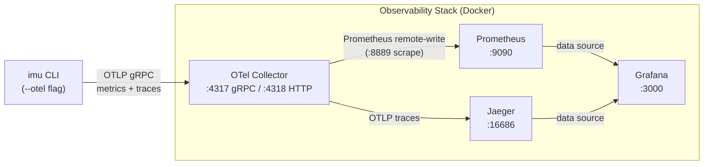
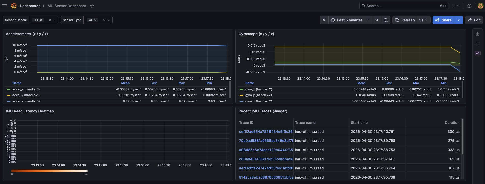

# Local Observability Stack — Setup & Operations

This page explains how to set up and operate the local observability infrastructure
(OTel Collector → Prometheus / Jaeger → Grafana) for the IMU CLI.

---

## 1. Architecture Overview



### Component Summary

| Component | Image | Role |
|-----------|-------|------|
| OTel Collector | `otel/opentelemetry-collector-contrib` | Receives OTLP telemetry, fans out to backends |
| Prometheus | `prom/prometheus` | Scrapes and stores metrics from the Collector |
| Jaeger | `jaegertracing/all-in-one` | Stores and visualises distributed traces |
| Grafana | `grafana/grafana` | Unified dashboard (Prometheus + Jaeger data sources) |

---

## 2. Quick Start

### Prerequisites

- [Docker](https://docs.docker.com/get-docker/) ≥ 24 with [Compose plugin](https://docs.docker.com/compose/)
- [uv](https://docs.astral.sh/uv/getting-started/installation/) (Python package manager)
- [GNU Make](https://www.gnu.org/software/make/)

### Step 1 — Create `.env`

```shell
cp .env.template .env
```

Edit `.env` and set secure passwords if desired (defaults are fine for local development):

```dotenv
GF_SECURITY_ADMIN_PASSWORD=changeme   # Grafana admin password
GF_VIEWER_PASSWORD=viewerpass         # Grafana viewer password
```

### Step 2 — Start the stack

```shell
make obs-up
```

This starts the following containers in the background:

| Container | Port |
|-----------|------|
| `adl-otel-collector` | 4317 (gRPC), 4318 (HTTP) |
| `adl-prometheus` | 9090 |
| `adl-jaeger` | 16686 |
| `adl-grafana` | 3000 |

Wait ~10 seconds for all services to become healthy.

### Step 3 — Send telemetry

Run the IMU CLI with the `--otel` flag to emit metrics and traces to the local Collector:

```shell
uv run python -m ai_driven_development_labs.imu.cli read \
    --hal mock --bus mock --count 10 --interval 1.0 --otel
```

By default the CLI sends OTLP gRPC to `http://localhost:4317`.
Override this via the `OTEL_EXPORTER_OTLP_ENDPOINT` environment variable if needed.

### Step 4 — Open Grafana

Navigate to <http://localhost:3000> in your browser and log in:

| Credential | Value |
|------------|-------|
| Username | `admin` |
| Password | value of `GF_SECURITY_ADMIN_PASSWORD` in `.env` (default: `changeme`) |

A **viewer** account (`viewer` / value of `GF_VIEWER_PASSWORD`) is created automatically on first startup.

Once signed in, open the **IMU Sensor Dashboard** to view live accelerometer / gyroscope readings,
the IMU read-latency heatmap, and the most recent traces from Jaeger:



---

## 3. Troubleshooting

### Port conflict — a container fails to start

If a port is already in use on your machine, Docker will refuse to bind it.

```text
Error response from daemon: Ports are not available: exposing port TCP 0.0.0.0:3000 -> 0.0.0.0:0: ...
```

Identify and stop the conflicting process:

```shell
# macOS / Linux
sudo lsof -i :<PORT>

# Kill the process (replace <PID> with the actual PID)
kill <PID>
```

Alternatively, change the host-side port mapping in `compose.observability.yml`:

```yaml
ports:
  - "3001:3000"   # map host 3001 → container 3000
```

### Verifying Collector logs

To confirm that the Collector is receiving telemetry:

```shell
make obs-logs
```

Or inspect only the Collector container:

```shell
docker logs adl-otel-collector --follow
```

Look for lines similar to:

```text
MetricsExporter    {"resource metrics": 1, "metrics": 6, "data points": 6}
TracesExporter     {"resource spans": 1, "spans": 1}
```

### Grafana shows "No data"

1. Confirm the Collector received data (see above).
2. Verify Prometheus is scraping successfully at <http://localhost:9090/targets>.
3. In Grafana **Explore**, choose the **Prometheus** data source and query `imu_accel_x` (or similar IMU metric names).

### Resetting all data

```shell
make obs-down   # removes containers AND named volumes (Prometheus + Grafana data)
make obs-up
```

---

## 4. Cleanup

To stop the stack and remove all containers, networks, and persistent volumes:

```shell
make obs-down
```

To stop without deleting volumes (preserve historical data across restarts):

```shell
docker compose -f compose.observability.yml down
```

---

## 5. References

- [OpenTelemetry Collector documentation](https://opentelemetry.io/docs/collector/)
- [Prometheus documentation](https://prometheus.io/docs/)
- [Jaeger documentation](https://www.jaegertracing.io/docs/)
- [Grafana documentation](https://grafana.com/docs/)
